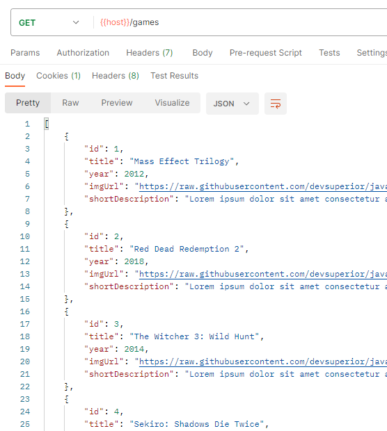
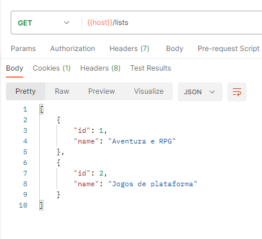

# DSlist

https://dslist-production-44bb.up.railway.app

DSList é uma aplicação backend com listagem de games por categoria.
O usuário poderá reordenar a posição do game de acordo com o desejado.

Desenvolvida durante as aulas do Intensivão Java Spring da DevSuperior.

## Tecnologias utilizadas
- Java
- Spring Boot
- Postgress

## Screenshots:
- Modelo de Dominio
> 

- GET Games
> 

- GET Listas de Categorias
>  

- GET Game por Id
> 

- GET games por lista categoria
> 

- POST reordenação de games
> 
